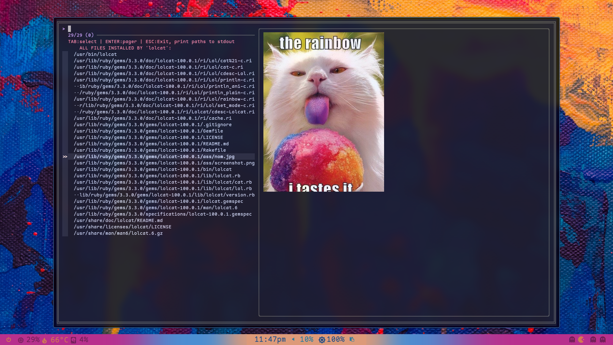

# fzf-pkg-files

<details><summary>Jump to Section</summary>

1. [Features](#features)
2. [Installation](#installation)<br>
   2.1 [Dependencies](#dependencies)
3. [Usage](#usage)<br>
   3.1 [Extending File Previews](#extending-file-previews)
4. [Contributing](#contributing)
5. [License](#license)

</details><br>



`fzf-pkg-files` is a user-friendly Bash script that leverages `fzf` to browse and preview all files installed by a pacman-managed package. This tool is particularly useful for Arch Linux users who want to quickly locate and inspect files associated with a specific package.


`fzf-pkg-files` is straightforward and easy to use. It only requires a single argument: either the name of an installed package, or the name of an installed command.


## Features

<table border="0">
<caption><b><i>&bigstar; Interactive File Browsing &bigstar;</i></b></caption>
<td>Use <code>fzf</code> to interactively browse through <u>all</u> files installed by a specific package.</td>
</table>

<table border="0">
<caption><b><i>&bigstar; Preview Many File Types &bigstar;</i></b></caption>
<tr><td>Preview the contents of various file types, including <i>pretty</i> <code>manpages</code>, <code>info files</code>, <code>PDFs</code>,<code>images</code>, and <b><i>more</i></b> directly within the <code>fzf</code> preview-window.</td></tr>
<tr><td><code>HTML</code> previews are stripped of distracting HTML tags and neatly formatted by <code><a href="https://github.com/JohannesKaufmann/html-to-markdown">html-to-markdown</a></code>, allowing you to focus on the actual content without the visual clutter of raw HTML.</td></tr>
</table>

<table border="0">
<caption><b><i>&bigstar; Syntax Highlighting &bigstar;</i></b></caption>
<td>Each file type has been carefully formatted for optimal readability. Enjoy syntax-highlighting for many languages, including <code>css</code>, <code>shellscripts</code>, <code>JavaScript</code>, <code>json</code>, <code>Markdown</code>, <code>Python</code>, <code>TypeScript</code>, <code>yaml</code>, and many more.</td>
</table>

<i>Note: this script does not actually alter any files. Formatting and syntax-highlighting only occur as a live-preview within `fzf`.</i>

## Installation

1. **Clone the Repository**:
   ```bash
   git clone https://github.com/kielmarj/fzf-pkg-files.git
   ```
2. **CD into the cloned-directory and make the script executable**:
   ```bash
   cd fzf-pkg-files
   chmod +x fzf-pkg-files
   ```
3. **Optionally, move the script to a directory in your PATH**

### Dependencies

***Required***<br>
Ensure the following dependencies are installed on your system:
* [`fzf`](https://github.com/junegunn/fzf) - A command-line fuzzy finder.
* [`pacman`](https://gitlab.archlinux.org/pacman/pacman) - The package manager for Arch Linux.
* [`bat`](https://github.com/sharkdp/bat) - A `cat(1)` clone with wings.

***Optional***<br>
The following tools are optional but recommended for optimal file previews:
* [`kitty`](https://github.com/kovidgoyal/kitty) - Cross-platform, fast, feature-rich, GPU-based terminal. Used by `fzf-pkg-files` to generate image previews.
* [`html-to-markdown`](https://github.com/JohannesKaufmann/html-to-markdown?tab=readme-ov-file) - Convert HTML to Markdown. Even works with entire websites and can be extended through rules.
* [`zcat`](https://www.gnu.org/software/gzip/) - Provided by the `gzip` package. Used by `fzf-pkg-files` to render previews of `Info files`.
* [`pdftotext`](https://github.com/jalan/pdftotext) - Simple PDF text extraction.

## Usage

To use `fzf-pkg-files`, simply run the script followed by the name of an installed package or command:
```bash
fzf-pkg-files <NAME OF INSTALLED PACMAN-MANAGED PACKAGE -OR- COMMAND>
```
In `fzf`, use <kbd>TAB</kbd> to select multiple files, <kbd>ENTER</kbd> to open selected files in a pager, & <kbd>ESC</kbd> to exit `fzf` & print selected file paths to `stdout`.

### Extending File Previews

To support additional file types or tweak an existing preview, edit the `get_preview_command` function in `fzf-pkg-files`:
1. Add a new `elif` condition based on the file extension, MIME type, or encoding.
2. Use `bat` or another tool for previewing.

Example for `.log` files:
```bash
elif [[ "$file" =~ \.log$ ]]; then
    bat --language=log "$file"
```

## Contributing

Contributions are welcome! If you have suggestions for improvements or encounter any issues, feel free to reach out, open an issue, submit a pull request. If you're really motivated, check out the [todo list](todo/todo.md) &#x1F609;.

## License

This project is licensed under the MIT License, so feel free to modify, reuse, share, etc as long as you include the original copyright and notice included in the LICENSE file.

<br>
<hr>

<div align="center">
  <samp>&copy; 2024 <a href="https://github.com/kielmarj">kielmarj</a> | Licensed under the MIT License</samp><br>
  <a href="https://www.buymeacoffee.com/kielmarj" target="_blank"></a>
  <br>
</div>
<br>
<div align="right"><sub>

[Up is the new down.  🔃](#fzf-pkg-files)

</sub></div>
